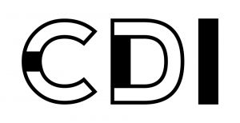

This project aims to cluster the descriptions of life-science-related companies and organizations operating in Berlin according to those obtained from their websites.
If the companies describe themselves similarly, they should be closer. This is sometimes the case, as in the case of blood-tumor diagnostics or radiotherapeutics. 
Some companies are very vague about their roles, which affects the embedding.

Click here to check it out:
[Berlin Company Map](https://micha-blip.github.io/company-map/index.html)

If you know about any companies, startups, or organizations that are not included in this list, please let me know!

Michał 

Career Development Initiative 2024

24-11-2024 Added 10 more companies to the database and updated the embedding

